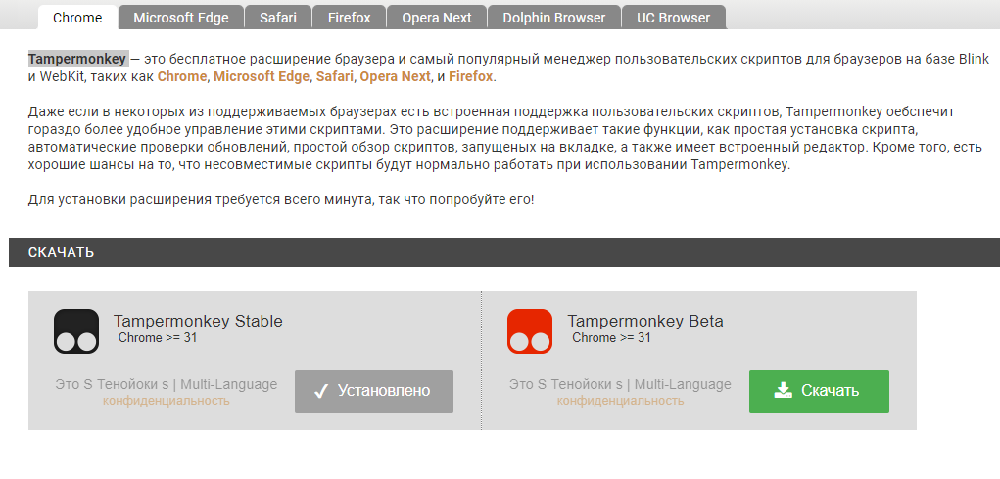
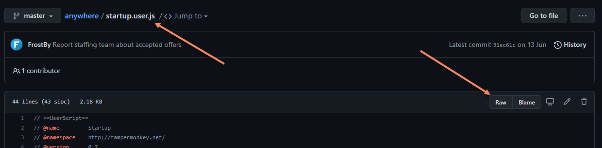
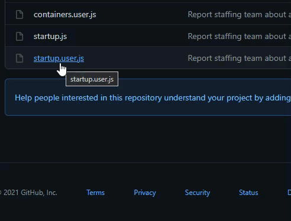
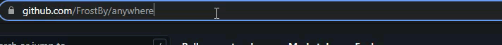
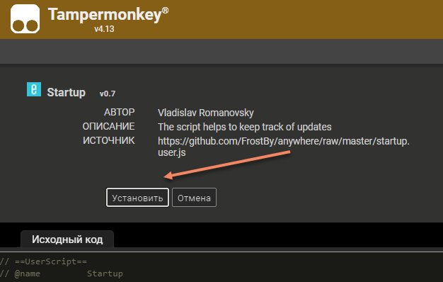
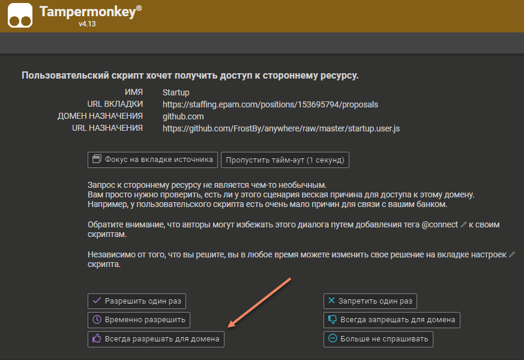

# EPAM Anywhere tools
### TamperMonkey extensions

### Features
- Используется [TamperMonkey](https://tampermonkey.net/)
- Поддержка всех современных браузеров
- Автоматическое обновление и контролль версий

## Установка
1. Перейдите на страницу расширения [TamperMonkey](https://tampermonkey.net/)
2. Установите расширение в свой браузер. В случае Safari - придется приобрести дешевую платную версию.
    
  
    
3. Откройте исходники каждого скрипта в этой дирректории. Например:
    
  
    
    - Если у вас установлено расширение AdGuard либо что-то перехватывает переход на скрипт или кнопку Raw:
      
       
       
     
    - Те же шаги для кнопки Raw 
      
4. Установите расширение
    
  
    
5. При переходе на страницу, связаную с расширением, дайте нужные доступы расширению
      
   
     